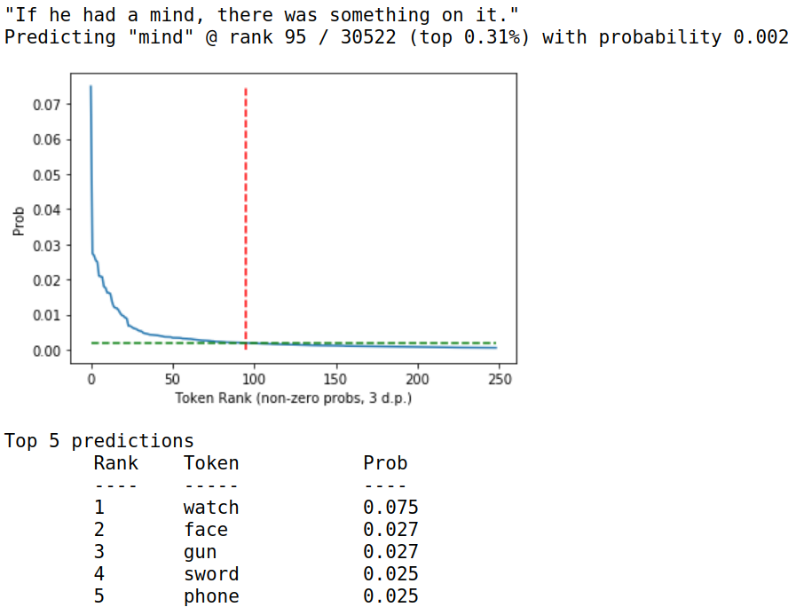

# Diagnostic Test for Transformer Language Models

This repository contains a callable for evaluating the predictions of
a transformer language model for a target word in some textual context.

An example:

Currently it is built to work with the `pytorch-transformers` library.

See `requirements.txt`.

## Usage

See `Example.ipynb`.
